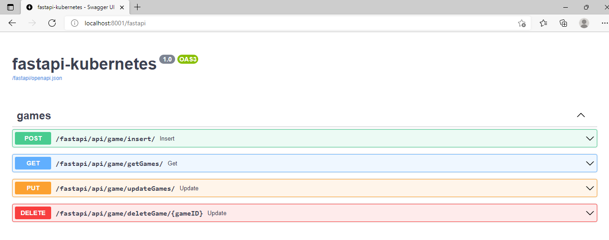
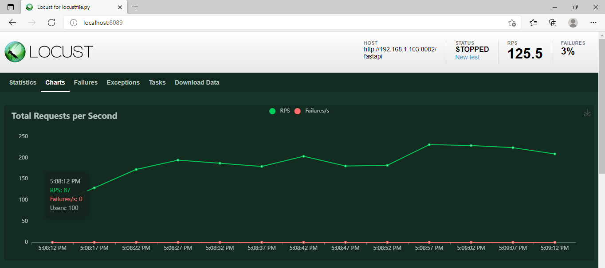

# fastapi-kubernetes

Python FastAPI real time Example with Dockerfile and configuration for Kubernetes

## Development setup
To run:

Run from active Python environment using `uvicorn`:

``python app.py``

Navigate to http://localhost:8080/fastapi to test the API.

## HowTo dockerize it

1. [Install](https://www.docker.com/get-started) docker.
2. Go to the directory where Dockerfile is
3. `docker build -t fastapi_kubernetes:1.0 .` (don't forget the dot)
4. docker run --name fastapi_kubernetes -d -p 8001:8001 fastapi_kubernetes:1.0

Done! Go to *localhost:8001* to see the app

##Kubernetes deployment

``kubectl apply -f api.yaml``

If working locally,use port forwarding to expose the service

``kubectl port-forward service/fastapi-kubernetes-svc 8002``

To scale the deployment, apply a HorizontalPodAutoscaler. Either:

    kubectl apply -f autoscale.yaml

## Load testing

Use `locust` to simulate a high load on the API

    pip install locust
    locust

## Teardown

    kubectl delete deployment fastapi-kubernetes
    kubectl delete svc fastapi-kubernetes-svc
    kubectl delete hpa fastapi-kubernetes-hpa